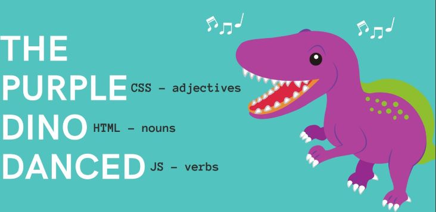
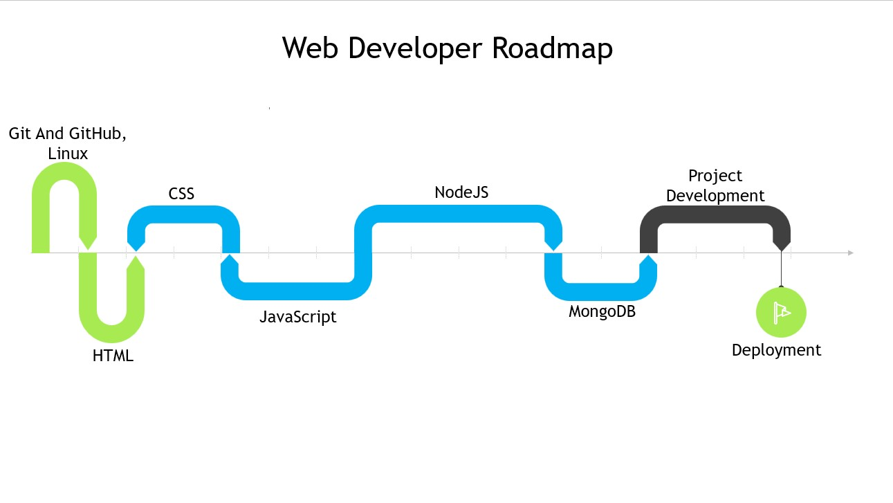

<!-- @format -->

# **Roadmap to Web Development**

## What Consists of The Web

- **FrontEnd**
- **BackEnd**

> Let's Think of it like a restaurant. we visit the restaurant make and order,
> the waiter comes and delivers the order. What we see and feel like decorations of the
> restaurant, taste of the food etc. are like the frontend of a website. We give order to the waiter who can be compared as a server that accepst request and gives us what we need. The backend can be compared to the kitchen where the food is being made by the chef.

## What to learn before starting WebDev?

**1)** **Git And GitHub:**

> A version control system essential for all kind of developers. Helps to manage
> your project better and easy for team to collaborate.

**2)** **Basic Linux Commands:**

> Some basic linux or terminal commands that will make your work way faster
> than GUI based interacion does.

**Resources:-**

[Kunal Kushwaha](https://youtu.be/apGV9Kg7ics)  
[BasicLinux](https://youtu.be/ZtqBQ68cfJc)

## **Front End**

### What exactly is FrontEnd?

> Front End Consists of everything we visually see and experience as a user.
> On the website Things like webpage you see the icons, the buttons, the scroll bar
> etc are a part of frontend.

## **Getting started in FrontEnd**

{align=center}

Think of FrontEnd as this Elephant, The HTML tells us what it is. like here if we ask
what is it the answer is Dino. in the same way HTML decides the basic structure of the
page. it defines various things like buttons, paragraphs , headings etc. on the page.

Whereas the CSS is like the adjective to The page. it tells us how the page is ,
how it looks. All the designing you see on a webpage is done by the css.

The javascript tells us what a particular thing on a webpage does.
To get started you just need to follow the below order

#### **HTML**

> Firstly learn HTML. It stands for HyperText Markup Language and it is pretty easy it will hardly take you a day or two to learn it. After learning this you'll be able to make basic structures of a webpage.

**_Resources for HTML_**

[Code With Harry](https://youtu.be/BsDoLVMnmZs)
[W3Schools](https://www.w3schools.com/html/)
[Programming With Mosh](https://youtu.be/qz0aGYrrlhU)

#### **CSS**

> I already talked about What is CSS. CSS Is a styling tool used for webpages. It is quite vast in nature although you will only need to learn the basic part of it you can always come back and look on the docs for help.

**_resources for css_**

[FreeCodeCamp.org](https://youtu.be/OXGznpKZ_sA)
[HTML&CSS](https://youtu.be/G3e-cpL7ofc)

#### **JavaScript**

> If you are just starting programming this will be your first proper programming
> language. you will learn a lot of new concepts which might be overwhelming to you
> in the beginning but you need to be consistent. After this you just need to
> integrate all three of them and you can start with you frontend development.
> (note: JS is also used in backend)

**Libraries**

> further you can learn different libraries in CSS and JS like SASS, Bootstrap, tailwind in CSS and React or angular in JS.

Start making small front end projects . Make a Clone of atleast frontends of 5 popular sites

## **BackEnd**

### What is BackEnd?

> Let's Take an example, we all have used google so what you see on the front page,
> the logo the space where we type is the front end but what happens when you type
> something and hit enter? well this is where backend comes into play. when you hit
> enter , a request is sent to the server, which then returns the search results. this
> action is done by the backend. Backend is where CRUD (Create , Read, Update, Delete)
> actions take place.

## **Getting started in BackEnd**

#### **NodeJS**

> It is a runtime environment where you can execute javascript. it provides Server side solution.

**_Resources for NodeJS_**

[FreeCodeCamp](https://youtu.be/Oe421EPjeBE)

#### **MongoDB**

> Now you need to create a database in the backend to store useful information
> submitted by the user or provide data that the user has requested. A popular Database
> used here is MongoDB,A NoSQL Database so it is very scalable in nature , updation and all
> things are quite easy here.

**_Resources for MongoDB_**
[Code With Harry](https://youtu.be/oSIv-E60NiU)

Now you can integrate it with you front end clone projects and try to make their backends too by using a dummy data.set.

### **Deploying the Website**

Now if you have made your own web dev project and you want to deploy it. Use, AWS, Docker ,git etc. to Deploy.

## **FULL ROADMAP**

